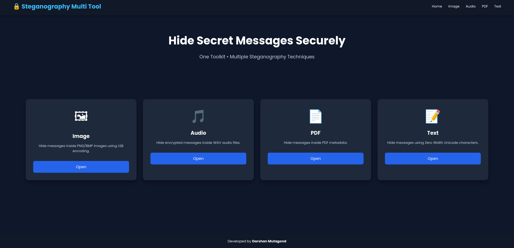
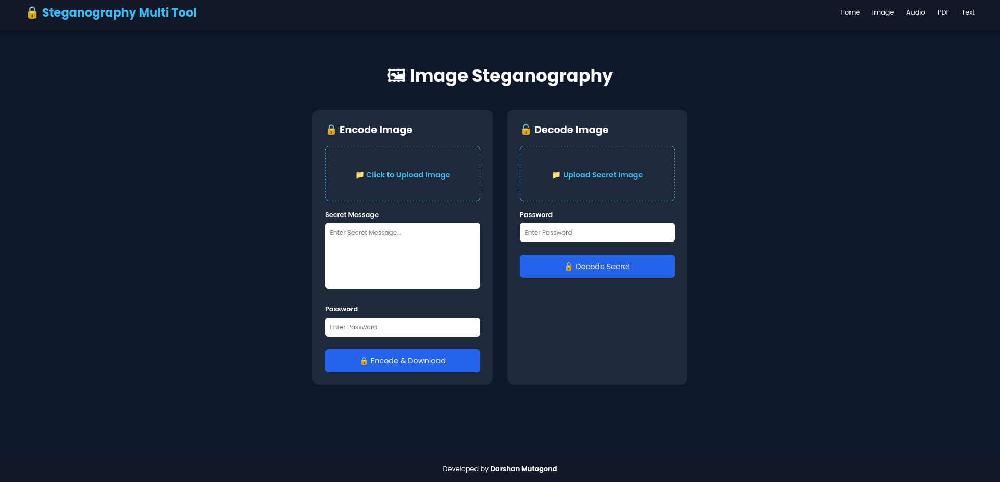
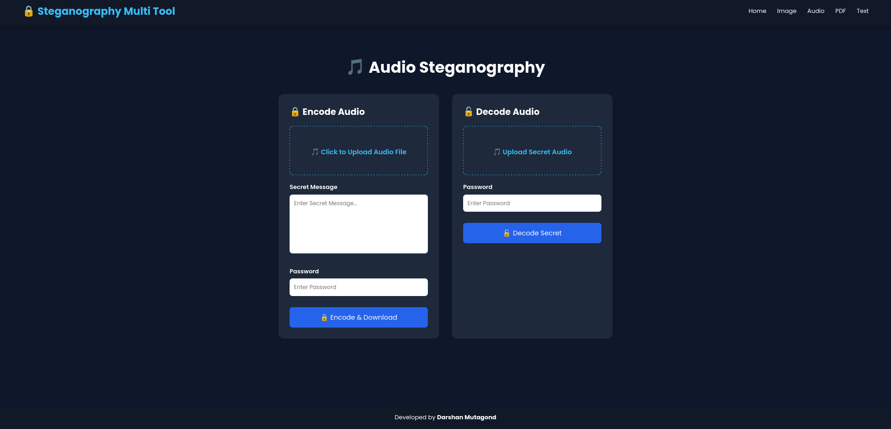
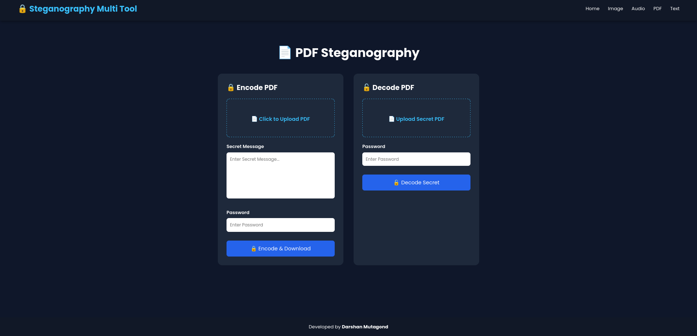
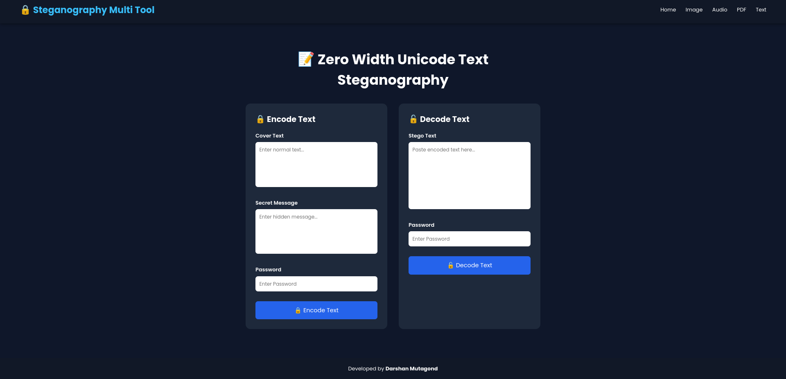

<p align="center">


</p>

---
# 🔐 Steganography Multi Tool

A Flask-based Cybersecurity Project for hiding encrypted messages inside different media.

## Features

- 🖼 Image Steganography (PNG/BMP)
- 🎵 Audio Steganography (WAV)
- 📄 PDF Metadata Steganography
- 📝 Zero Width Unicode Text Steganography
- 🔒 AES-256 Encryption
- 🔑 Password Protection


## Installation

```bash
git clone https://github.com/123DarshanM/Steganography-Multi-Tool

cd Steganography-Multi-Tool

python3 -m venv venv

source venv/bin/activate

pip install -r requirements.txt

python app.py

xdg-open http://127.0.0.1:5000

```


# 📷 Screenshots

## 🏠 Home Page



---

## 🖼 Image Steganography



---

## 🎵 Audio Steganography



---

## 📄 PDF Steganography



---

## 📝 Zero Width Unicode Text



---

## Author

Darshan M
